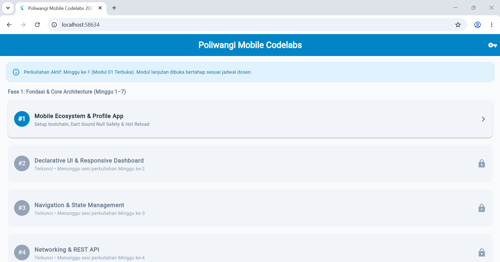
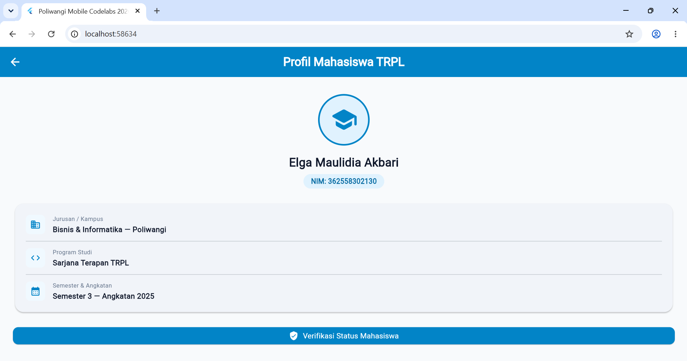

# Laporan Praktikum Modul 01: Mobile Ecosystem, Flutter Setup & Profile App

- **Nama**: Elga Maulidia Akbari
- **NIM**: 36255830210
- **Kelas / Prodi**: 3E / Sarjana Terapan TRPL
- **Mata Kuliah**: Pemrograman Perangkat Bergerak (Semester 3)

---

## 1. Ringkasan Aktivitas
Minggu ini saya mempelajari dasar-dasar pengembangan aplikasi mobile menggunakan Flutter dan bahasa pemrograman Dart. Fokus kegiatan saya meliputi penyiapan environment kerja di VS Code, pemahaman struktur direktori proyek, pembuatan halaman profil mahasiswa, serta pembuatan antarmuka dasbor akademik agar tampil rapi dan responsif.

Selain itu, saya juga belajar melakukan troubleshooting ketika menghadapi kendala teknis. Hal ini mencakup perbaikan aturan penamaan proyek Dart (snake_case), penanganan dependensi pubspec.yaml, hingga penyelesaian error rendering pada komponen daftar (ListView). Saat ini, aplikasi sudah berhasil dibuat dan dapat dijalankan dengan baik di browser maupun emulator.

## 2. Bukti Tangkapan Layar (Running App)
[Sertakan minimal 2 screenshot bukti aplikasi profil berjalan di emulator atau HP fisik Anda]

## 3. Kendala yang Dihadapi & Solusinya
Kendala: Terdapat pesan error TypeError: Null check operator used on a null value yang menyebabkan kesalahan rendering pada widget ListView di file academic_dashboard_screen.dart (baris 89). Masalah ini terjadi karena kode mencoba membaca data yang bernilai kosong (null) menggunakan operator !. Selain itu, sempat muncul error penamaan folder saat awal membuat proyek.

Solusi: Saya memeriksa baris kode yang bermasalah, lalu menambahkan pengecekan data null (memberikan nilai default atau menggunakan operator ?) sebelum data dirender ke tampilan. Untuk masalah penamaan proyek, saya mengatasinya dengan menjalankan perintah flutter create --project-name mobile_starter_template . agar nama proyek menjadi valid dan pubspec.yaml dapat terbaca.

## 4. Jawaban Pertanyaan Refleksi
Pilihan Native vs Flutter:Pemilihan bergantung pada kebutuhan proyek. Native cocok dipilih jika aplikasi membutuhkan performa super cepat dan akses mendalam ke fitur perangkat keras HP. Sementara Flutter lebih hemat waktu dan biaya karena dengan satu kode program (single codebase), kita bisa langsung menghasilkan aplikasi untuk Android dan iOS sekaligus.Prinsip UI = f(state):Prinsip ini menjelaskan bahwa tampilan layar ($UI$) merupakan hasil dari data atau kondisi ($state$) aplikasi saat itu. Jadi, ketika data di dalam aplikasi mengalami perubahan, tampilan layar akan secara otomatis diperbarui mengikuti data terbaru tersebut.Pentingnya Conventional Commits:Menggunakan standar Conventional Commits (seperti awalan feat: untuk fitur baru atau fix: untuk perbaikan error) sangat penting agar riwayat perubahan di Git tersusun rapi. Hal ini memudahkan kolaborasi dalam tim, mempercepat proses peninjauan kode (code review), dan mempermudah pelacakan jika terjadi masalah pada kodingan.