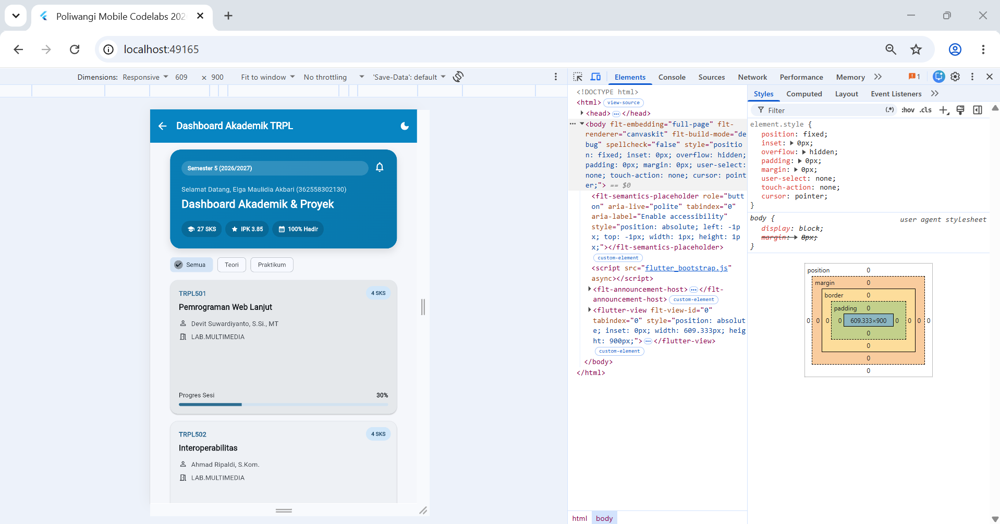
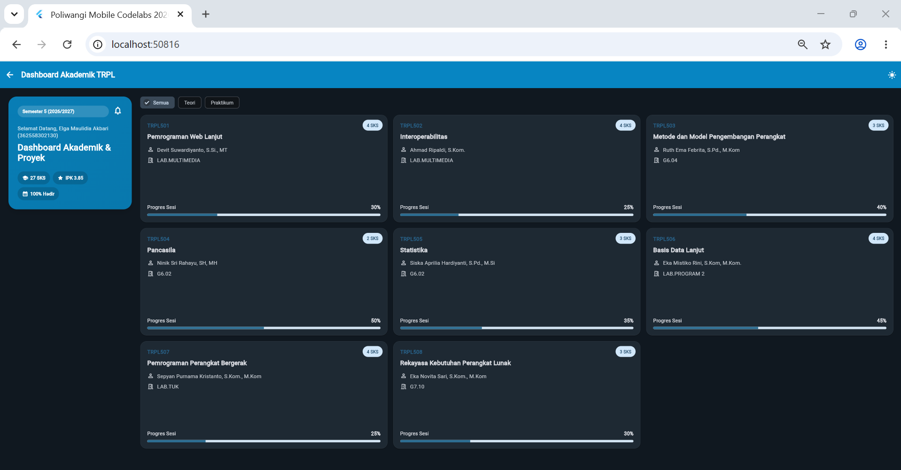
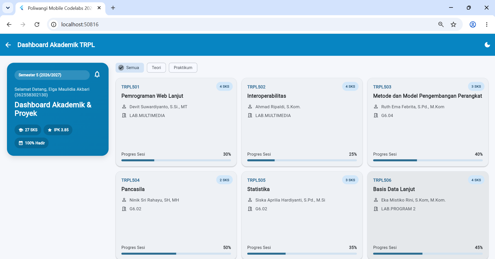

# Laporan Praktikum Modul 02: Declarative UI & Responsive Layout

- **Nama**: Elga Maulidia Akbari
- **NIM**: 362558302130
- **Kelas / Prodi**: 2E / Sarjana Terapan TRPL
- **Mata Kuliah**: Pemrograman Perangkat Bergerak (Semester 3)

---

## 1. Ringkasan Implementasi

Pada praktikum Modul 02 ini saya memodifikasi aplikasi Dashboard Akademik Mahasiswa menggunakan Flutter dengan konsep **Declarative UI** dan **Responsive Layout**.

Dashboard dibuat menggunakan beberapa widget terpisah agar kode lebih mudah dikelola, yaitu `HeaderBanner`, `CourseCard`, dan model data `Course`.

Untuk membuat tampilan responsif, saya menggunakan `LayoutBuilder` untuk membaca lebar layar. Pada ukuran layar yang lebih besar, dashboard menggunakan layout dua bagian, yaitu banner informasi mahasiswa di sebelah kiri dan daftar mata kuliah di sebelah kanan. Daftar mata kuliah ditampilkan menggunakan `GridView.builder`.

Pada ukuran layar yang lebih kecil seperti smartphone, tampilan berubah menjadi satu kolom menggunakan `ListView`, sehingga isi dashboard tetap dapat digunakan tanpa menyebabkan `RenderFlex overflow`.

Saya juga menggunakan **Material 3 `ThemeData`** untuk mengatur tampilan aplikasi dan menyediakan fitur perubahan antara **Light Theme** dan **Dark Theme**.

Selain itu, terdapat fitur filter mata kuliah berdasarkan kategori:

- Semua
- Teori
- Praktikum

Filter dibuat menggunakan `StatefulWidget` dan `setState()` sehingga daftar mata kuliah dapat berubah secara langsung ketika kategori dipilih.

Setiap kartu mata kuliah juga dapat diklik. Ketika kartu ditekan, aplikasi menampilkan `showModalBottomSheet` yang berisi informasi dan rincian mata kuliah.

---

## 2. Bukti Tangkapan Layar (Running App)

Berikut adalah bukti hasil running aplikasi pada beberapa ukuran dan kondisi layar.

| Mode Portrait (Light) | Mode Dark Theme | Mode Landscape / Tablet (2 Kolom) |
|---|---|---|
|  |  |  |

### Penjelasan

**Portrait Light Theme**

Menampilkan dashboard dalam mode terang pada perangkat smartphone dengan layout satu kolom. Banner mahasiswa ditampilkan di bagian atas, kemudian filter kategori dan daftar mata kuliah.

**Dark Theme**

Menampilkan dashboard dengan mode gelap. Tema dapat diubah melalui tombol ikon bulan/matahari pada bagian kanan AppBar.

**Landscape / Tablet**

Pada layar yang lebih lebar, layout berubah menjadi dua bagian. Informasi mahasiswa berada di sebelah kiri, sedangkan filter dan daftar mata kuliah berada di sebelah kanan dalam bentuk grid.

---

## 3. Kendala Layout yang Dihadapi & Solusinya

### Kendala 1: Ukuran banner terlalu lebar pada layar desktop

Pada awal implementasi, banner informasi mahasiswa menggunakan `Expanded` dengan pembagian `flex`. Akibatnya, pada layar yang lebar kotak biru mengambil area terlalu besar sehingga tampilan tidak sesuai dengan desain yang diinginkan.

### Solusi

Saya mengganti pembagian `flex` dengan `SizedBox` yang memiliki lebar tertentu pada layout desktop/tablet.

Contohnya:

```dart
SizedBox(
  width: 655,
  child: HeaderBanner(
    courses: _courses,
  ),
),